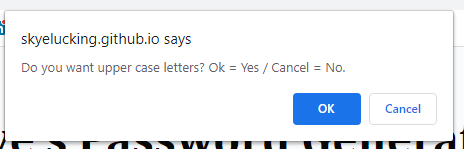

# Skye Lucking - 03 JavaScript Password Generator (Using the Class Example)

<h1>Description of application</h1>
This application generates a password that:
- Asks the user how long they'd like the password length to be
- Validates that the length so that it is bewteen 8 and 128 characters
- Prompts the user asking if they want 1. lower case 2. upper case 3. numbers 4. special characters
- Validates that they select at least 1 character type
- Populates the password placeholder with a password 

<h1>Screenshot</h1>
 
 
 
 
 
 
 
 
 
 
 

<h1>Link to the deployed application</h1>
<a href="https://skyelucking.github.io/classexample03-JavaScript-password-generator/">https://skyelucking.github.io/classexample03-JavaScript-password-generator</a>

<h1>Link to GitHub Repo</h1>
<a href="https://github.com/skyelucking/classexample03-JavaScript-password-generator">https://github.com/skyelucking/classexample03-JavaScript-password-generator</a>

Now here is your joke... 
What’s Forrest Gump’s password? 
 
 
 
<em>1forrest1!</em>